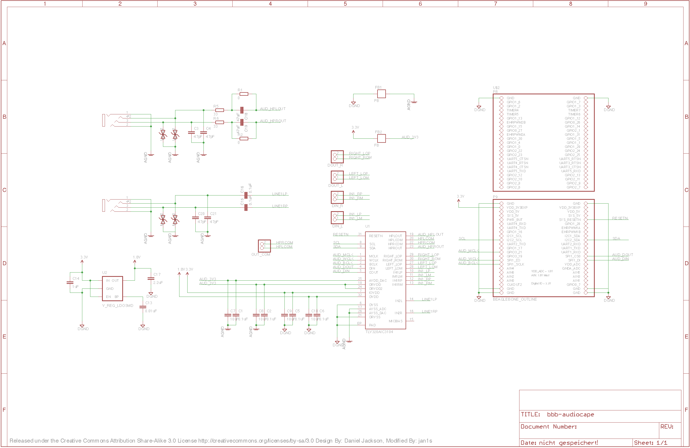
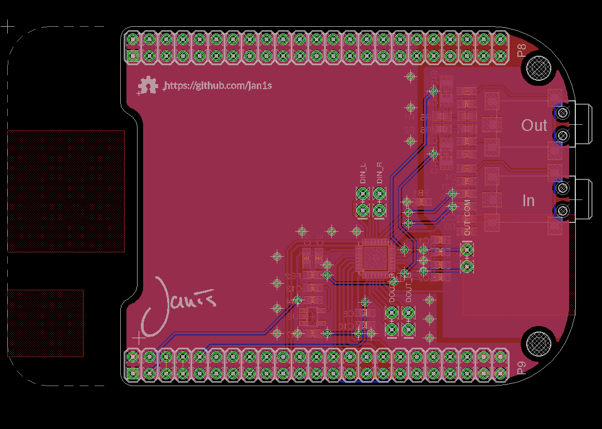

hw-bbb-audiocape
================

First of all: This project is a clone of [CircuitCo Audio Cape][circuitco].

It is not commercial in any form, just fun for me to play around.
If you want an Audio Cape, go and get one of theirs.

## Hardware

Project schematic.

Render of the board.

## Setup on Arch

The setup guide is mainly taken from [eLinux.org - BBB Audio Cape RevB Getting Started][gettingstarted].

Get the tools if not already installed:

`pacman -S wget`

`pacman -S unzip`

`pacman -S dct-overlay`

Download and unzip the device tree source:

`wget http://elinux.org/images/1/10/BB-BONE-AUDI-02-00A0.zip`

`unzip BB-BONE-AUDI-02-00A0.zip`

Compile the device tree file and move it to /lib/firmware:

`dtc -O dtb -o BB-BONE-AUDI-02-00A0.dtbo -b 0 -@ BB-BONE-AUDI-02-00A0.dts`

`mv BB-BONE-AUDI-02-00A0.dtbo /lib/firmware`

Notice that the dtc-overlay version needs to be installed, since the old dtc is not accepting the @ option.

The Cape is sharing the audio signal with the onboard HDMI. Therefore HDMI audio needs to be disabled.
Edit the uEnv.txt file, that your uboot is using:

`optargs=capemgr.disable_partno=BB-BONELT-HDMI`

In order to activate the cape you need to reboot.
Load the Device Tree file for the cape:

`echo BB-BONE-AUDI-02 > /sys/devices/bone_capemgr*/slots`

To make that persistent just add the following line in /etc/default/capemgr :

`CAPE=BB-BONE-AUDI-02`

## Test and play

Play alternating noise on the 2 output channels:

`speaker-test -c 2`

Play alternating sine waves on the 2 output channels:

`speaker-test -c 2 -t sine`

## BOM
| Identifier | Type/Value | Quantity | Comment | Supplier Id | Supplier |
| ---        | ---        | ---      | ---     | ---         | ---      |
| R1, R2 | 0 Ω | 2 | not populated | SMD-0603 0  | [Reichelt][reichelt] |
| R5, R6 | 33 Ω | 2 |  | SMD-0603 33 | [Reichelt][reichelt] |
| C3, C4, C20, C21 | 47 pF | 2 |  | NPO-G0603 47P | [Reichelt][reichelt] |
| C13 | 10 nF | 1 |  | X7R-G0603 10N | [Reichelt][reichelt] |
| C1, C2, C5, C6, C15, C16 | 100 nF | 6 |  | X7R-G0603 100N | [Reichelt][reichelt] |
| C7-C10, C14, C17 | 10 µF | 6 |  | X5R-G0603 10/6 | [Reichelt][reichelt] |
| C18, C19 | 47 µF | 2 |  | X5R-G1206 47/6 | [Reichelt][reichelt] |
| J1, J2 | 4pol TRS Jack | 2 |  | LUM 1503-13V | [Reichelt][reichelt] |
| J3, J4 | 2row Pin Header | 2 |  | SL 2X25G 2,54 | [Reichelt][reichelt] |
| D1-D4 | Suppressor Diodes | 4 |  | 863-ESD9B3.3ST5G | [Mouser][mouser] |
| U1 | Stereo CODEC | 1 |  | 595-TLV320C3104IRHBT | [Mouser][mouser] |
| U2 | LDO 1.8V | 1 |  | 595-TLV70218DBVR | [Mouser][mouser] |

[reichelt]: http://www.reichelt.de
[mouser]: http://mouser.com

[itead-pcb]: http://imall.iteadstudio.com/open-pcb/pcb-prototyping.html

[circuitco]: http://elinux.org/CircuitCo:Audio_Cape_RevB
[gettingstarted]: http://elinux.org/BBB_Audio_Cape_RevB_Getting_Started
